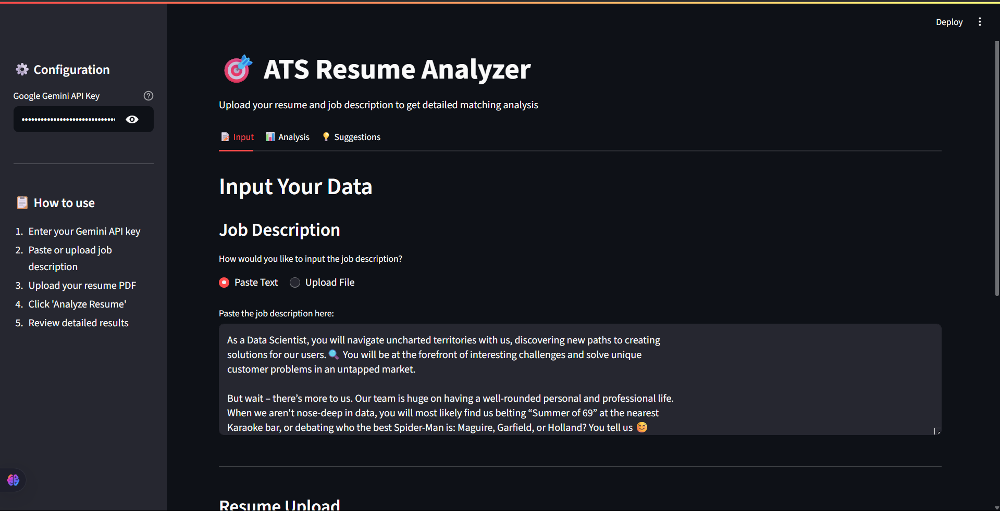

# 🎯 ResumeSync

An intelligent ATS (Applicant Tracking System) resume analyzer that helps job seekers optimize their resumes for specific job descriptions using Google's Gemini AI.

## ✨ Features

- **AI-Powered Analysis**: Uses Google Gemini AI for intelligent resume-job matching
- **PDF Resume Processing**: Extracts and analyzes text from PDF resumes
- **Comprehensive Scoring**: Provides overall match score and section-wise analysis
- **Skills Gap Analysis**: Identifies matched and missing skills
- **Interactive Dashboard**: Beautiful visualizations with charts and gauges
- **Actionable Recommendations**: Specific suggestions for resume improvement
- **Export Reports**: Download analysis results as CSV
- **Professional UI**: Clean, modern interface built with Streamlit

## 🚀 Demo



_Upload your resume and job description to get instant AI-powered analysis_

## 🛠️ Installation

### Prerequisites

- Python 3.7 or higher
- Google Gemini API key ([Get it here](https://makersuite.google.com/app/apikey))

### Setup

1. **Clone the repository**

```bash
git clone https://github.com/yourusername/ResumeSync.git
cd ResumeSync
```

2. **Create a virtual environment**

```bash
python -m venv venv
```

On Windows

```bash
venv\Scripts\activate
```

On macOS/Linux

```bash
source venv/bin/activate
```

3. **Install dependencies**

```bash
pip install -r requirements.txt
```

4. **Set up environment variables**
   Create a .env file in the project root

```bash
echo "GOOGLE_API_KEY=your_gemini_api_key_here" > .env
```

5. **Run the application**

```bash
streamlit run app.py
```

6. **Open your browser**
   Navigate to `http://localhost:8501`

## 📁 Project Structure

```
ResumeSync/
├── app.py # Main Streamlit application
├── requirements.txt # Python dependencies
├── .env # Environment variables (not in repo)
├── README.md # Project documentation
├── utils/
│ ├── init.py
│ ├── pdf_processor.py # PDF text extraction utilities
│ └── gemini_analyzer.py # AI analysis functions
├── screenshots/ # Application screenshots
└── .gitignore # Git ignore file
```

## 🎯 How It Works

1. **Input Phase**

   - Upload your resume (PDF format)
   - Paste or upload the job description
   - Enter your Google Gemini API key

2. **Analysis Phase**

   - AI extracts and processes text from your resume
   - Compares resume content against job requirements
   - Generates comprehensive matching analysis

3. **Results Phase**
   - View overall match score and section-wise breakdown
   - Identify matched and missing skills
   - Get actionable improvement recommendations
   - Export detailed reports

## 🔧 Configuration

### API Key Setup

You'll need a Google Gemini API key to use this application:

1. Visit [Google AI Studio](https://makersuite.google.com/app/apikey)
2. Create a new API key
3. Add it to your `.env` file or enter it in the app's sidebar

### Supported File Formats

- **Resume**: PDF files only
- **Job Description**: Text paste or PDF/TXT file upload

## 📊 Analysis Features

### Overall Scoring

- **Match Score**: 0-100% compatibility rating
- **Section Scores**: Individual analysis of experience, education, and skills
- **Performance Visualization**: Interactive gauges and charts

### Skills Analysis

- **Matched Skills**: Skills from your resume that align with job requirements
- **Missing Skills**: Important skills mentioned in job description but absent from resume
- **Keyword Matching**: Relevant keywords found in both documents

### Recommendations

- **Improvement Suggestions**: AI-generated recommendations for each resume section
- **Gap Analysis**: Specific areas where your resume can be strengthened
- **Actionable Insights**: Practical steps to increase your match score

## 🎨 User Interface

- **Clean Design**: Professional, modern interface
- **Interactive Charts**: Visual representation of analysis results
- **Responsive Layout**: Works on desktop and mobile devices
- **Intuitive Navigation**: Easy-to-use tabs and sections

## 🚀 Usage Examples

### Basic Analysis

Upload resume.pdf and job-description.txt
Click "Analyze Resume"
View results in Analysis tab
text

### Advanced Features

- Export analysis results as CSV
- Generate section-specific improvement suggestions
- Compare multiple resumes against the same job description

## 🤝 Contributing

Contributions are welcome! Please feel free to submit a Pull Request.

### Development Setup

1. Fork the repository
2. Create your feature branch (`git checkout -b feature/AmazingFeature`)
3. Commit your changes (`git commit -m 'Add some AmazingFeature'`)
4. Push to the branch (`git push origin feature/AmazingFeature`)
5. Open a Pull Request

### Code Style

- Follow PEP 8 Python style guidelines
- Add comments for complex functions
- Update README.md for new features

## 📝 License

This project is licensed under the MIT License - see the [LICENSE](LICENSE) file for details.

## 🔒 Privacy & Security

- **No Data Storage**: Your resumes and job descriptions are not stored on any servers
- **Secure Processing**: All analysis happens in real-time and data is discarded after processing
- **API Security**: Your Gemini API key is handled securely and not logged

## 🐛 Troubleshooting

### Common Issues

**PDF Processing Errors**

- Ensure your PDF is text-based (not scanned images)
- Try a different PDF if extraction fails

**API Errors**

- Verify your Gemini API key is correct
- Check your internet connection
- Ensure you have API quota remaining

**Installation Issues**

- Make sure you're using Python 3.7+
- Try creating a fresh virtual environment
- Install dependencies one by one if bulk install fails

## 📞 Support

If you encounter any issues or have questions:

1. Check the [Issues](https://github.com/snigdha/ResumeSync/issues) page
2. Create a new issue with detailed description
3. Include error messages and screenshots if applicable

## 🔮 Future Enhancements

- [ ] Support for DOCX resume format
- [ ] Batch processing for multiple resumes
- [ ] Resume builder integration
- [ ] Multi-language support

## 👏 Acknowledgments

- **Google Gemini AI** for powerful natural language processing
- **Streamlit** for the amazing web framework
- **PyPDF2** for PDF processing capabilities
- **Plotly** for beautiful data visualizations

---

**Made with ❤️ by Snigdha**

_Help job seekers land their dream jobs with AI-powered resume optimization_
